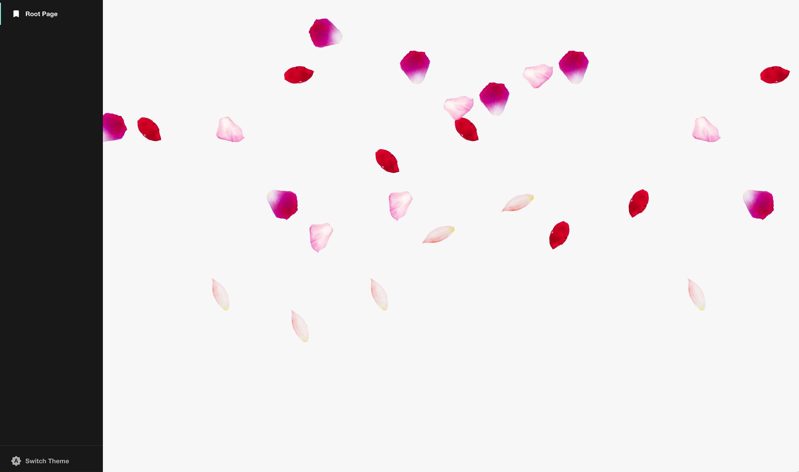

# backstage-plugin-festive-fun

Welcome to the backstage-plugin-festive-fun plugin!

_This plugin was created through the Backstage CLI_

## Overview

Looking to bring a bit of festivity to your Backstage instance? We'll you've found the plugin. Festive fun currently delivers all the seasons via animations to Backstage to make the app just a little more fun and engaging. Based upon the season you're in, it will render a festive visual to match. Custom festivity selector can be passed in as well to allow teams to modify which theme should render and when!

**_Note_**: This is all being rendered behind the core app at the app at z-index of -1. Allowing for no conflicts of clicks and flows seamlessly behind any components rendered at z-index of 0 or greater.

### Spring

Soothing spring animates flower petals falling as growth begins



### Summer

Summer vibes animates swelling waves as seen from the beach


### Fall

Festive fall animates the lovely fall foliage descending to the ground


### Winter

Winter wonderland animates a relaxing snow storm


## Getting started

### Install the package

```bash
# From your Backstage root directory
yarn add --cwd packages/app backstage-plugin-festive-fun
```

### Add the component

Add the **FestiveFun** to the root level app creation in `packages/app/src/App.tsx`:

```diff
+ import { FestiveFun } from 'backstage-plugin-festive-fun';

  export default app.createRoot(
    <>
      <AlertDisplay transientTimeoutMs={2500} />
      <OAuthRequestDialog />
      <AppRouter>
        <Root>{routes}</Root>
+       <FestiveFun />
        {/* other components... */}
      </AppRouter>
    </>,
  );
```

### Component Customization

Currently three properties exist for customization.

- **initialShowInSeconds**: amount of time component is rendered before disappearing when feature flag is not enabled, default is 15 seconds. Use 0 to not render unless FF enabled.

- **festivity**: the festivity that will render and override the auto selector based upon the current date

- **festivitySelector**: custom selector to choose when to render which festivity. If no matching value is returned, nothing will be displayed

```diff
+ const festivitySelector = () => {
+   const month = new Date().getMonth() + 1;
+   if (month >= 3 && month <= 5) {
+      return 'spring';
+    }
+
+    return 'summer';
+  }

  export default app.createRoot(
    <>
      <AlertDisplay transientTimeoutMs={2500} />
      <OAuthRequestDialog />
      <AppRouter>
        <Root>{routes}</Root>
+       <FestiveFun
+         initialShowInSeconds={600}
+         festivity='summer' // This overrides festivitySelector if defined
+         festivitySelector={festivitySelector}
+       />
        {/* other components... */}
      </AppRouter>
    </>,
  );
```
